<p align="center">
  
</p>

<h1 align="center">OpenSilver</h1>

<p align="center">
  <strong>Build Cross-Platform Apps with C#, VB.NET, or F# and XAML</strong><br>
  One codebase. Six platforms. Powered by WebAssembly and .NET.
</p>

<p align="center">
  <a href="https://www.nuget.org/packages/OpenSilver"></a>
  <a href="LICENSE.txt"></a>
  <a href="https://opensilver.net"></a>
</p>

<p align="center">
  <a href="https://opensilver.net">Website</a> ·
  <a href="https://doc.opensilver.net">Documentation</a> ·
  <a href="https://xaml.io">Try Online</a> ·
  <a href="https://opensilverShowcase.com">200+ Live Samples</a> ·
  <a href="https://opensilver.net/gallery">Gallery</a> ·
  <a href="https://opensilver.net/whats-new/">What's New</a> ·
  <a href="https://opensilver.net/contact/">Contact</a>
</p>

---

## What is OpenSilver?

**OpenSilver** is a modern, open-source framework for building cross-platform applications using **C#**, **VB.NET**, or **F#** combined with **XAML**. Write your code once and deploy to:

- **Web** (via WebAssembly)
- **Android**, **iOS**, **Windows**, **macOS** (via .NET MAUI Hybrid)
- **Linux** (via Photino)

OpenSilver is like **WPF, but cross-platform and evolved**. It brings the productivity of XAML and the power of .NET to every major platform.

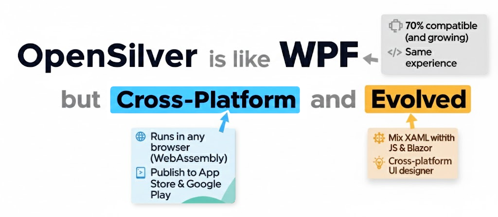

Visit the [Gallery](https://opensilver.net/gallery) to see real-world applications built with OpenSilver.

### How It Works

OpenSilver is **not** an emulator or a wrapper. It is a complete reimplementation of the WPF/Silverlight API from scratch, using modern .NET, WebAssembly, and the browser's DOM.

Unlike canvas-based rendering approaches, OpenSilver renders XAML using **real HTML elements**: `TextBox` becomes `<div contenteditable>`, `MediaElement` becomes `<video>`, hyperlinks become `<a href>`, and so on.

This DOM-based approach unlocks native browser behaviors: Ctrl+F search, text selection, screen readers, right-click context menus, SEO indexing, browser translation, copy/paste, mobile long-press, browser extensions, and regulatory accessibility compliance.

---

## Features

### - For New Projects Creation:

| Feature | Description |
|---------|-------------|
| **Multi-Language Support** | Write in C#, VB.NET, or F#. OpenSilver is one of the very few solutions that lets you build web apps with VB.NET + XAML or F# + XAML |
| **True Cross-Platform** | Single codebase compiles to Web, Android, iOS, Windows, macOS, and Linux |
| **DOM-Based Rendering** | XAML renders to real HTML elements, enabling native browser behaviors: accessibility, SEO, Ctrl+F, text selection, screen readers, browser translation, and more |
| **Full .NET Ecosystem** | Reference any .NET NuGet package. Use familiar libraries and patterns |
| **JavaScript Interop** | Easily call any JavaScript library when needed. Works on all target platforms |
| **Blazor Integration** | Mix XAML and Razor in the same project. Use Blazor components inline in XAML files. Access component libraries from DevExpress, Syncfusion, Radzen, Blazorise, MudBlazor, and more |
| **Visual XAML Designer** | Drag-and-drop UI designer works in Visual Studio, VS Code (Windows, macOS, Linux), and online at [XAML.io](https://xaml.io). It's the first XAML designer for VS Code! |

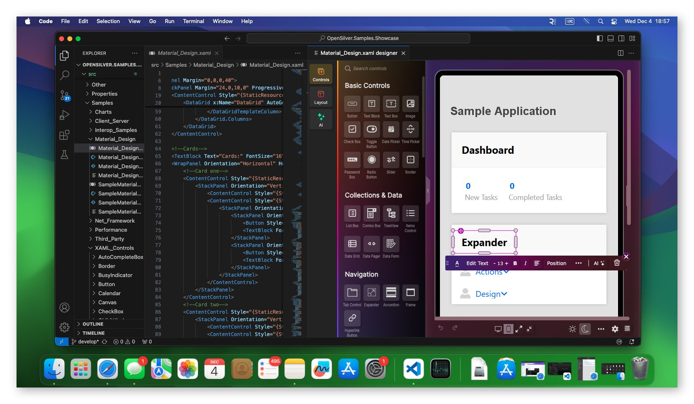

### - For Migration Projects:

OpenSilver provides a proven path to modernize legacy applications:

- **Silverlight** apps can be migrated with minimal code changes (99% compatibility)
- **WPF** apps can be ported to run in the browser and on mobile (70%+ compatibility, growing)
- **LightSwitch** apps can be migrated (LightSwitch Compatibility Pack available)
- **WinForms** apps can be modernized (requires more refactoring)

> **Professional Migration Services:** The team behind OpenSilver (Userware) has been migrating enterprise applications since 2014. From Fortune 500 companies to specialized business apps, our team is available for custom development, support contracts, and complete migration projects. [Contact us](https://opensilver.net/contact/) to discuss your project.

---

## 🌐 Try OpenSilver Without Installing Anything

### XAML.io: Online Playground

Visit **[XAML.io](https://xaml.io)** to write and run C#/XAML code directly in your browser. No installation required. Perfect for:
- Quick experiments and prototyping
- Learning XAML and OpenSilver
- Sharing code snippets with colleagues

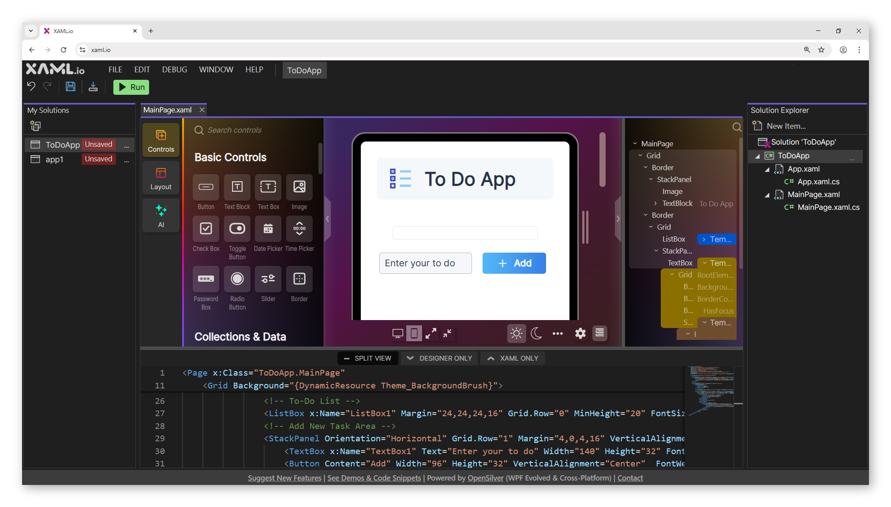

### OpenSilver Showcase: 200+ Live Samples

Explore **[OpenSilverShowcase.com](https://opensilverShowcase.com)** to see over 200 interactive C#/XAML samples running live in your browser:

- Controls, layouts, data binding, interop, native API access, and more examples
- View source code for each sample with a toggle to switch between **C#**, **VB.NET**, and **F#**
- Examples of Blazor component integration (DevExpress, Syncfusion, Radzen, Blazorise, MudBlazor)

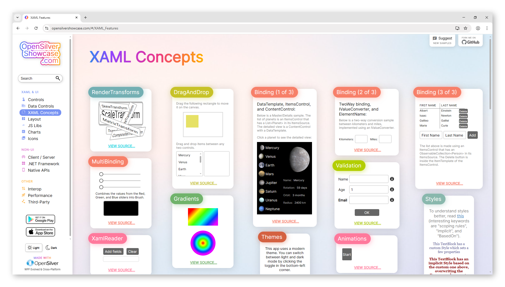

The Showcase is also available as a native app:
- [Android (Google Play)](https://play.google.com/store/apps/details?id=net.opensilver.showcase)
- [iOS (App Store)](https://apps.apple.com/us/app/opensilver-showcase/id6746472943)
- [Web (Live)](https://opensilverShowcase.com)
- [Source Code (GitHub)](https://github.com/OpenSilver/OpenSilver.Samples.Showcase)

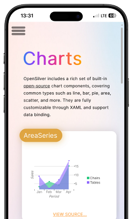

---

## 📦 Getting Started

### Option 1: Visual Studio (Windows)

**Prerequisites:**
- Visual Studio 2022 or newer (including VS 2026) with the `ASP.NET and web development` and `.NET desktop development` workloads
- To target mobile/desktop platforms, install the `.NET Multi-platform App UI development` workload (Not required if you target only the Web)
- .NET 8.0 SDK or later

**Installation:**

1. Download the OpenSilver extension (VSIX) from [opensilver.net/download](https://opensilver.net/download/)
2. Launch Visual Studio and click "Create a new project"
3. Search for "OpenSilver" and select the OpenSilver Application template
4. Choose your target platforms (Web, MAUI Hybrid for mobile/desktop, Photino for Linux). For the fastest compilation and development loop, start with Web only
5. Press `F5` to build and run!

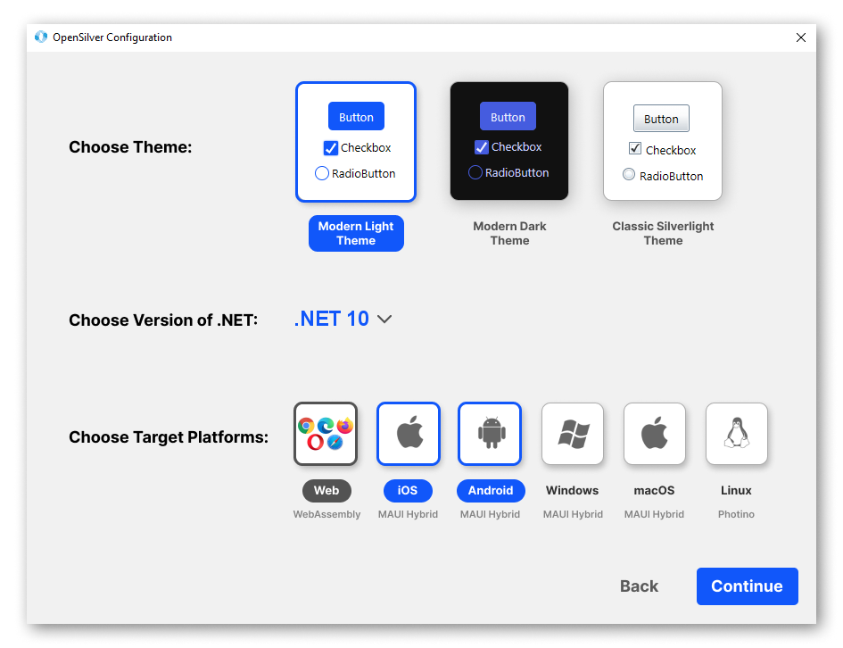

**Important:** When using MAUI Hybrid, use a short project name (e.g., "MyApp") and place your solution folder close to the root directory (e.g., `C:\MyApp\`) to avoid path length limitations.

**Tip:** If you want to use the very latest iteration of OpenSilver rather than the latest stable release, open the NuGet Package Manager and check "Include prerelease". Preview packages are automatically built for each commit on the `develop` branch and published to a [MyGet feed](https://www.myget.org/F/opensilver/api/v3/index.json). This feed is already configured in the `nuget.config` file next to your `.sln`, but if preview packages don't appear, select the MyGet feed from the package source dropdown in the top-right of the NuGet Package Manager. [Learn more](https://doc.opensilver.net/documentation/how-to-topics/get-latest-preview-version.html)

### Option 2: Visual Studio Code (Windows, macOS, Linux)

**Prerequisites:**
- VS Code with the OpenSilver extension
- .NET 8.0 SDK or later

**Installation:**

1. Install the [OpenSilver extension for VS Code](https://marketplace.visualstudio.com/items?itemName=userware.vscode-opensilver)
2. The extension includes project templates AND the visual XAML designer (the first XAML designer for VS Code!)
3. Open the Command Palette (`Ctrl+Shift+P` or `Cmd+Shift+P`) and run `OpenSilver: Create New Project`

The VS Code extension works cross-platform on Windows, macOS, and Linux.

### Option 3: Command Line (CLI)

For developers who prefer terminal-based workflows:

```bash
# Install the OpenSilver templates
dotnet new install OpenSilver.Templates

# Create a new OpenSilver application
dotnet new opensilverapp -n MyApp

# Build and run
cd MyApp
dotnet build
dotnet run --project MyApp.Browser
```

> **All extensions can be built from source:** [github.com/OpenSilver/OpenSilver.VSIX](https://github.com/OpenSilver/OpenSilver.VSIX)

---

## Project Structure

When you create an OpenSilver project, you'll see a solution with multiple projects:

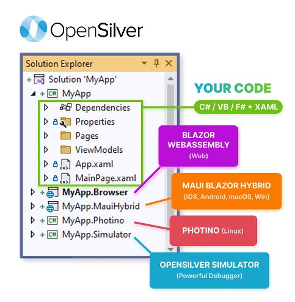

| Project | Description |
|---------|-------------|
| **MyApp** | Main project containing all your C#/XAML files. This project cannot be run directly. |
| **MyApp.Browser** | Entry point for Web deployment (WebAssembly) |
| **MyApp.MauiHybrid** | Entry point for Android, iOS, Windows, macOS (via .NET MAUI) |
| **MyApp.Photino** | Entry point for Linux desktop (via Photino) |

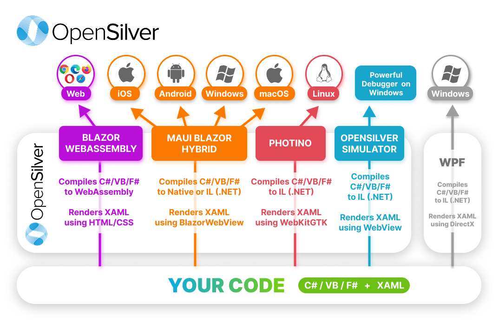

---

## Your First OpenSilver App

```xml
<!-- MainPage.xaml -->
<Page x:Class="MyApp.MainPage"
      xmlns="http://schemas.microsoft.com/winfx/2006/xaml/presentation"
      xmlns:x="http://schemas.microsoft.com/winfx/2006/xaml">
    <StackPanel HorizontalAlignment="Center" VerticalAlignment="Center">
        <TextBlock Text="Hello, OpenSilver!" FontSize="32" Margin="0,0,0,20"/>
        <Button Content="Click Me!" Click="Button_Click"/>
        <TextBlock x:Name="ResultText" FontSize="18" Margin="0,20,0,0"/>
    </StackPanel>
</Page>
```

```csharp
// MainPage.xaml.cs (C# version)
using System;
using System.Windows;
using System.Windows.Controls;

namespace MyApp;

public partial class MainPage : Page
{
    private int clickCount = 0;

    public MainPage()
    {
        InitializeComponent();
    }

    private void Button_Click(object sender, RoutedEventArgs e)
    {
        clickCount++;
        ResultText.Text = $"Button clicked {clickCount} time(s)!";
    }
}
```

```vb
' MainPage.xaml.vb (VB.NET version)
Imports System
Imports System.Windows
Imports System.Windows.Controls

Namespace MyApp
    Partial Public Class MainPage
        Inherits Page

        Private clickCount As Integer = 0

        Public Sub New()
            InitializeComponent()
        End Sub

        Private Sub Button_Click(sender As Object, e As RoutedEventArgs)
            clickCount += 1
            ResultText.Text = $"Button clicked {clickCount} time(s)!"
        End Sub
    End Class
End Namespace
```

---

## Options to Expand Your App

### Option 1: Use .NET NuGet Packages

Any non-UI NuGet package works directly, unless it uses APIs unavailable in .NET for WebAssembly. Since OpenSilver and Blazor WASM share the same .NET for WebAssembly stack, any non-UI package that works in Blazor WebAssembly will work in OpenSilver too.

```xml
<PackageReference Include="Newtonsoft.Json" Version="13.0.3" />
```

### Option 2: Call JavaScript Libraries

Easy interop with the entire JavaScript ecosystem:

```csharp
// Call any JavaScript function
Interop.ExecuteJavaScript("alert('Hello from C#!')");
```

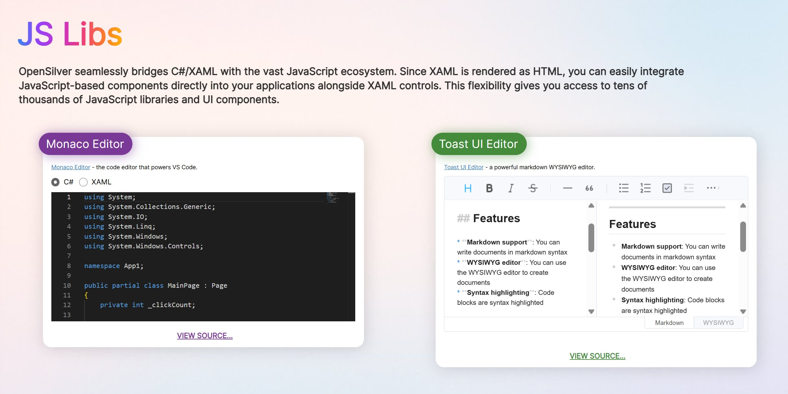

Learn more: [Interop Overview](https://doc.opensilver.net/documentation/general/javascript-interop-and-libraries.html) · [In-Depth Guide](https://doc.opensilver.net/documentation/in-depth-topics/call-javascript-from-csharp.html) · [Interop Samples](https://opensilvershowcase.com/#/Interop_Samples) · [JS Libraries Samples](https://opensilvershowcase.com/#/JS_Libs)

### Option 3: Mix XAML and Blazor (OpenSilver 3.3+)

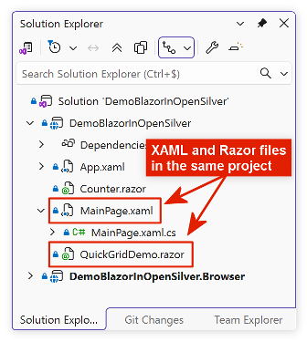

You can embed Razor code directly inside XAML using the `<RazorComponent>` tag:

```xml
<Page x:Class="MyApp.MainPage"
      xmlns="http://schemas.microsoft.com/winfx/2006/xaml/presentation"
      xmlns:x="http://schemas.microsoft.com/winfx/2006/xaml"
      xmlns:razor="clr-namespace:OpenSilver.Blazor;assembly=OpenSilver.Blazor">

    <StackPanel>
        <TextBlock Text="This is XAML" FontSize="24"/>
        
        <razor:RazorComponent>
            <h3>Hello from Blazor!</h3>
            <p>Message: "{Binding Message, Type=String}"</p>
        </razor:RazorComponent>
    </StackPanel>
</Page>
```

Or reference external `.razor` files:

```xml
<razor:RazorComponent ComponentType="{x:Type local:MyCounter}" />
```

This unlocks the entire Blazor ecosystem: use components from **DevExpress**, **Syncfusion**, **Radzen**, **Blazorise**, **MudBlazor**, and more!

Learn more: [OpenSilver + Blazor Documentation](https://doc.opensilver.net/documentation/general/opensilver-blazor.html)

---

## 📖 Documentation and Resources

| Resource | Description |
|----------|-------------|
| [Official Documentation](https://doc.opensilver.net) | Comprehensive guides, tutorials, and API reference |
| [Getting Started Tutorial](https://doc.opensilver.net/documentation/general/getting-started-tour.html) | Step-by-step walkthrough for beginners |
| [OpenSilverShowcase.com](https://OpenSilverShowcase.com) | 200+ live samples with source code |

---

## ⚡ Performance Tips

**Understanding performance modes:** Debug mode is the slowest mode and not representative of production performance. Release mode is ~30% faster. Publishing (to IIS, to a local folder, or to a server) is ~3x faster than Debug. Publishing with AOT enabled is ~2x faster than without AOT, meaning ~6x faster than Debug overall.

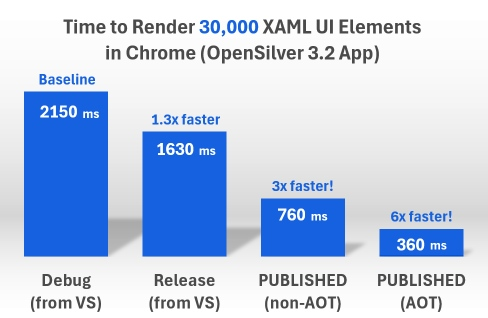

| Tip | Description |
|-----|-------------|
| **Enable AOT Compilation** | Ahead-of-Time compilation improves speed by up to 6x. Not enabled by default due to longer compile times, but recommended for production. |
| **Use Virtualization** | Enable virtualization for lists, comboboxes, and treeviews with many items. |
| **Enable IIS Compression** | Significantly reduces initial loading time when publishing. |
| **Lazy-Load Assemblies** | Consider lazy-loading large referenced assemblies to improve startup time. |

---

## 🐛 Troubleshooting Tips

### Debugging

- **Debugging is slow?** Use the Simulator for the best debugging experience in Visual Studio
- **Breakpoints not hit?** Try disabling "Enable Just My Code" (Tools > Options > Debugging > General > uncheck "Enable Just My Code")
- **Debugging issues?** Try disabling code optimization (right-click project > Properties > Build > uncheck "Optimize code")

### XAML Files

- All XAML files must have: **Build Action** = `Content`, **Custom Tool** = `MSBuild:Compile`
- If you only change XAML files (no C#/VB.NET/F# changes), you may need to manually **Rebuild** the solution to see changes

### MAUI Hybrid

- **"GetLatestMSVCVersion" error:** The MAUI workload is not installed. Install it via the Visual Studio Installer.
- **"GenerateStaticWebAssetEndpointsPropsFile" error:** File path exceeded 256 characters. Use a shorter project name and move the solution closer to the root directory.

### WCF and Client/Server Communication

- For REST calls, use `HttpClient` instead of `WebClient`
- Configure CORS and the SameSite attribute for cross-domain calls
- For applications using RIA Services (like the "Business Application" template), refer to the [Business Applications documentation](https://doc.opensilver.net/documentation/general/business-app.html)

For more troubleshooting tips, see the [documentation](https://doc.opensilver.net) or [contact us](https://opensilver.net/contact).


---

## 🛠️ Building from Source

Want to contribute or customize OpenSilver? Follow these steps to build from source.

### Prerequisites

- Visual Studio 2022 or newer (latest version recommended)
- Developer Command Prompt for VS 2022 (or newer)

### Build Steps

1. **Clone the Repository**
   
   ```bash
   git clone https://github.com/OpenSilver/OpenSilver.git
   cd OpenSilver
   ```

2. **Restore Packages**
   
   Run the restoration script at the root of the repository:
   ```bash
   restore-packages-opensilver.bat
   ```

3. **Update Compiler Assemblies**
   
   OpenSilver has a dependency on an older version of itself to convert XAML files to C#. The restored version may sometimes have outdated compiler assemblies. To ensure you have the latest, run:
   ```bash
   cd build
   update-compiler.bat
   ```

4. **Build the NuGet Package**
   
   Open the **Developer Command Prompt for VS 2022** (not the standard Command Prompt) and navigate to the `build` folder:
   ```bash
   cd build
   build-nuget-package-OpenSilver.bat
   ```
   When prompted, enter a version identifier (e.g., `2026-01-30`).

5. **Use Your Custom Build**
   
   The built NuGet packages will be in `build/output/OpenSilver/`. To use them in your projects:
   - Add a [local NuGet source](https://stackoverflow.com/a/55167481/17088417) pointing to that folder
   - In the NuGet Package Manager, check "Include prerelease" to see your custom packages

### Tips for Faster Development

- **Use TestApplication:** The main solution (`OpenSilver.sln`) includes a `TestApplication.OpenSilver.Browser` project that directly references the OpenSilver runtime instead of referencing the NuGet package. This is ideal for rapid development: changes to the OpenSilver runtime immediately affect the TestApplication without rebuilding packages or copying DLLs.

- **Build only the Runtime DLL:** Instead of rebuilding the entire package for every change, you can build just the OpenSilver Runtime project.

- **Auto-copy with Post Build:** Add a Post Build action to the OpenSilver Runtime project to automatically copy the DLL to your NuGet cache:
  ```
  C:\Users\YOUR_USER_NAME\.nuget\packages\opensilver\VERSION\lib\netstandard2.0\
  ```

- **Other packages:** There are also separate batch files for building the Simulator, WebAssembly, MAUI Hybrid, and other packages as needed.

### Troubleshooting

- **Compilation errors:** A Visual Studio workload may need to be installed. Open `OpenSilver.sln` in Visual Studio to check for missing components.
- **Command Prompt issues:** Make sure you use the "Developer Command Prompt for VS 2022" (not the standard Command Prompt). Some paths in the batch files are relative to the current directory.
- **Still having issues?** [Open an Issue on GitHub](https://github.com/OpenSilver/OpenSilver/issues) or [Contact the OpenSilver team](https://opensilver.net/contact.aspx)

### Repository Structure

| Folder | Description |
|--------|-------------|
| `src/Runtime` | Core OpenSilver runtime (the C#/XAML framework) |
| `src/Compiler` | XAML to C# compiler |
| `src/Simulator` | Windows Simulator for debugging |
| `src/WebAssembly` | WebAssembly integration |
| `src/Maui` | .NET MAUI Hybrid integration |
| `src/Photino` | Photino integration for Linux |
| `src/Tests` | Unit tests and TestApplication |
| `build` | Build scripts, NuGet specifications, and output folder |

### Branches

| Branch | Description |
|--------|-------------|
| `develop` | Active development. Submit pull requests here. |
| `master` | Stable releases. Corresponds to packages on NuGet.org. |

---

## 🤝 Contributing

We welcome contributions from the community! Whether it's fixing bugs, improving documentation, or adding new features, every contribution helps make OpenSilver better.

- Read our [Contributing Guide](CONTRIBUTING.md)
- Check out the [open issues](https://github.com/OpenSilver/OpenSilver/issues)
- Submit pull requests to the `develop` branch

---

## 🔗 Related Repositories

| Repository | Description |
|------------|-------------|
| [OpenSilver.VSIX](https://github.com/OpenSilver/OpenSilver.VSIX) | Source code for Visual Studio, VS Code, and CLI extensions |
| [OpenSilver.Documentation](https://github.com/OpenSilver/OpenSilver.Documentation) | Documentation source |
| [OpenSilver.Samples.Showcase](https://github.com/OpenSilver/OpenSilver.Samples.Showcase) | Source code for the Showcase app (200+ samples) |

---

## 📜 License

OpenSilver is **free and open source**, released under the **[MIT License](LICENSE.txt)**.

You can use OpenSilver in commercial projects without any licensing fees. While not required, attribution and links to [opensilver.net](https://opensilver.net) are greatly appreciated!

---

## 💬 Get in Touch

| | |
|--|--|
| **Website** | [opensilver.net](https://opensilver.net) |
| **Documentation** | [doc.opensilver.net](https://doc.opensilver.net) |
| **Contact** | [opensilver.net/contact](https://opensilver.net/contact) |
| **Email** | contact@opensilver.net |

### Professional Support and Migration Services

OpenSilver is backed by **Userware**, the company that created and maintains the framework. We offer:

- **Support contracts** for enterprises
- **Custom development** services
- **Migration services** for Silverlight, WPF, LightSwitch, and WinForms applications
- **Training and consulting**

Our team has been migrating complex enterprise applications since 2014. [Contact us](https://opensilver.net/contact.aspx) to discuss how we can help with your project.

---

<p align="center">
  <strong>⭐ Star this repository if you find OpenSilver useful!</strong><br>
  Your support helps us grow the community and improve the framework.
</p>
